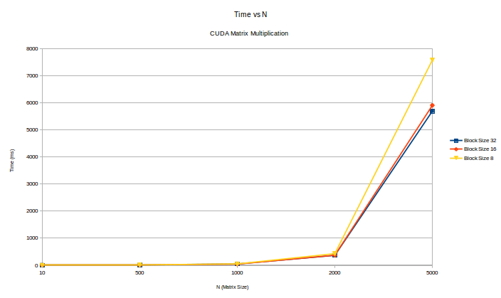

# Matrix Multiplication using CUDA

#### Meet Pragnesh Shah | 13D070003  

### Experiments and Conclusion

I ran the experiments for square matrices of size N = [ 10, 500, 1000 , 2000, 5000 ]. Since we have to use the datatype `long int` for N =10000 , the entire matrices A, B and C cannot fit onto a 2GB GPU, hence I cannot run it on the GPU on sharada server. The trends however would be similar had the GPU had more memory. The plots of the time taken for computing A*B for the given sizes are plotted against the Block Size varying from 8 to 32.

As we can see from the plots the reduction in time is significant when going from `Block Size` going from 8 to 32 fr larger matrices which is obvious due to paralellism. This can be easily reasoned out by saying that as we increase the block size we allow the kernels to run as paralelly as possible.

**Note : I have implemented the more efficient matrix multiplication which uses shared block memory to enhcane the block memory cache hit rate and hence reduces time.**
 
#### Plots

Time Taken vs Block Size 

### Graphic Processing Unit Configuration

#### GPU 1
   * description: VGA compatible controller
   * product: NVIDIA Corporation
   * vendor: NVIDIA Corporation
   * physical id: 0
   * bus info: pci@0000:01:00.0
   * version: a1
   * width: 64 bits
   * clock: 33MHz
   * capabilities: vga_controller bus_master cap_list rom
   * configuration: driver=nvidia latency=0
   * resources: irq:47 memory:f6000000-f6ffffff memory:e0000000-e7ffffff memory:e8000000-e9ffffff ioport:e000(size=128) memory:f7000000-f707ffff

#### GPU 2
   * description: Display controller
   * product: Haswell Integrated Graphics Controller
   * vendor: Intel Corporation
   * physical id: 2
   * bus info: pci@0000:00:02.0
   * version: 06
   * width: 64 bits
   * clock: 33MHz
   * capabilities: bus_master cap_list
   * configuration: latency=0
   * resources: memory:f7400000-f77fffff memory:d0000000-dfffffff ioport:f000(size=64)