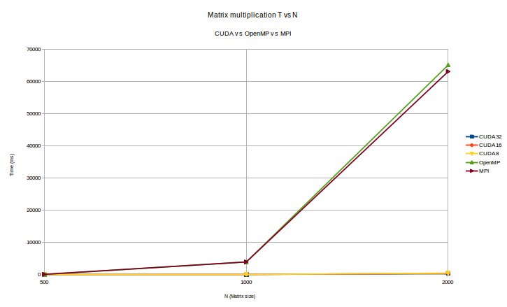

# Profiling Matrix Multiplication using gprof and valgrind

#### Meet Pragnesh Shah | 13D070003  

### Experiments and Conclusion

As suggested in class, I used gprof to generate the flat time profile and call graphs of the beinaries and I used valgrind to generate the hit/miss rate reports. 

The analysis for CUDA, OpenMP and MPI can be found in separate files in the respective directories:
   * `analysis/valgrind`
   * `analysis/gprof`

#### Conclusion and Analysis: 

##### OpenMP
   * Easy to parallelize pure serial code.
   * Parallizes even small loops. 
   * No message passing overhead. 

##### MPI
   * Parallizes larger loops more efficiently than OpenMP as message overhead is low. 
   * Message passing overhead significant when parallelizing small matrices. 

##### CUDA
   * Can be used to achieve massive parallelism.
   * No messaging overhead and shared memory in blocks allow efficient usage of cache.
   * Significantly faster than OpenMP and MPI in large matrix operations.

#### Valgrind profiling

I used the following script to profile the binaries using cachegrind (i.e. valgrind) to generate the hit and miss rates for L1, L2 and L3 caches.

``` bash
echo "Running OpenMP Code"
echo "Threads = 4"
export OMP_NUM_THREADS=4
echo "Generating hit/miss rate report"                          
valgrind --log-file="analysis/OpenMP_analysis_valgrind.txt" --tool=cachegrind ./OpenMP 

echo "Running MPI Code"
echo "Threads = 4"
echo "Generating hit/miss rate report"                          
valgrind --log-file="analysis/MPI_analysis_valgrind.txt" --tool=cachegrind mpirun -np 4 MPI 

echo "Running CUDA Code"
echo "BlockSize = 32"
echo "Generating hit/miss rate report"                          
valgrind --log-file="analysis/CUDA_analysis_valgrind.txt" --tool=cachegrind ./CUDA

rm cache*
rm gmon.out
echo "Done Profiling"
```
 
#### gprof profiling 

I used the following script to generate the Call Graphs and Time Profiling of different functions using gprof.

``` bash
echo "Running OpenMP Code"
echo "Threads = 4"
export OMP_NUM_THREADS=4
echo "Generating gmon.out file for Profiling"                          
./OpenMP
echo "Flat Profiling Code and Generating Call Graph" 
gprof OpenMP gmon.out > analysis/OpenMP_analysis_gprof.txt
rm gmon.out

echo "Running MPI Code"
echo "Threads = 4"
echo "Generating gmon.out file for Profiling"                          
mpirun -np 4 MPI
echo "Flat Profiling Code and Generating Call Graph" 
gprof MPI gmon.out > analysis/MPI_analysis_gprof.txt
rm gmon.out

echo "Running CUDA Code"
echo "BlockSize = 32"
echo "Generating gmon.out file for Profiling"                          
./CUDA
echo "Flat Profiling Code and Generating Call Graph" 
gprof CUDA gmon.out > analysis/CUDA_analysis_gprof.txt
rm gmon.out
```

#### Plots

Comparison of CUDA, OpenMP and MPI in a single graph 



### CPU and GPU Configuration

#### Desktop Configuration

* Architecture:          x86_64
* CPU op-mode(s):        32-bit, 64-bit
* Byte Order:            Little Endian
* CPU(s):                4
* On-line CPU(s) list:   0-3
* Thread(s) per core:    2
* Core(s) per socket:    2
* Socket(s):             1
* NUMA node(s):          1
* Vendor ID:             GenuineIntel
* CPU family:            6
* Model:                 61
* Stepping:              4
* CPU MHz:               804.750
* BogoMIPS:              4788.76
* Virtualization:        VT-x
* L1d cache:             32K
* L1i cache:             32K
* L2 cache:              256K
* L3 cache:              4096K
* NUMA node0 CPU(s):     0-3

#### Memory Configuration

* Total RAM = 2x4096 MB

* Handle 0x0055, DMI type 17, 34 bytes
* Memory Device
   * Array Handle: 0x0050
   * Error Information Handle: Not Provided
   * Total Width: 64 bits
   * Data Width: 64 bits
   * Size: 4096 MB
   * Form Factor: SODIMM
   * Set: None
   * Locator: DIMM A
   * Bank Locator: Not Specified
   * Type: DDR3
   * Type Detail: Synchronous
   * Speed: 1600 MHz
   * Manufacturer: Kingston
   * Serial Number: 9F8887E6
   * Asset Tag: 9876543210
   * Part Number: KNWMX1-ETB
   * Rank: 1
   * Configured Clock Speed: 1600 MHz

#### GPU 1
   * description: VGA compatible controller
   * product: NVIDIA Corporation
   * vendor: NVIDIA Corporation
   * physical id: 0
   * bus info: pci@0000:01:00.0
   * version: a1
   * width: 64 bits
   * clock: 33MHz
   * capabilities: vga_controller bus_master cap_list rom
   * configuration: driver=nvidia latency=0
   * resources: irq:47 memory:f6000000-f6ffffff memory:e0000000-e7ffffff memory:e8000000-e9ffffff ioport:e000(size=128) memory:f7000000-f707ffff

#### GPU 2
   * description: Display controller
   * product: Haswell Integrated Graphics Controller
   * vendor: Intel Corporation
   * physical id: 2
   * bus info: pci@0000:00:02.0
   * version: 06
   * width: 64 bits
   * clock: 33MHz
   * capabilities: bus_master cap_list
   * configuration: latency=0
   * resources: memory:f7400000-f77fffff memory:d0000000-dfffffff ioport:f000(size=64)